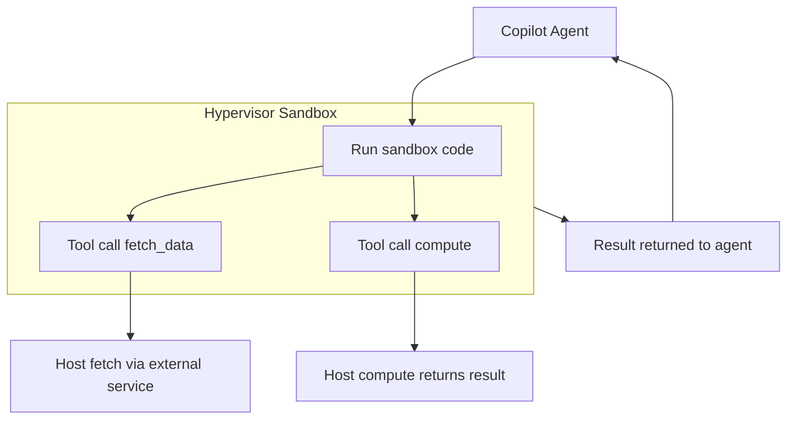

<div align="center">
    <h1>Hyperlight</h1>
    
    <p><strong>Hyperlight is a lightweight Virtual Machine Manager (VMM) designed to be embedded within applications. It enables safe execution of untrusted code within <i>micro virtual machines</i> with very low latency and minimal overhead.</strong> <br> We are a <a href="https://cncf.io/">Cloud Native Computing Foundation</a> sandbox project. </p>
</div>

# Hyperlight Sandbox

A multi-backend sandboxing framework for running untrusted code with controlled host capabilities. Built on [Hyperlight](https://github.com/hyperlight-dev/hyperlight).

Supported backends:

- [Wasm Component Sandbox](#wasm-component-sandbox) (Python/Javascript or provide your own)
- [HyperlightJS Sandbox](#hyperlightjs-sandbox)
- [Nanvix Sandbox](#nanvix-sandbox)

## Overview

hyperlight-sandbox provides a unified API across multiple isolation backends. All backends share a common capability model.  A python, .NET, and rust SDK is provided.

- **Secure code execution** -- Run untrusted code in hardware isolated sandboxes (KVM, MSHV, Hyper-v)
- **Host tool dispatch** -- Register callables as tools; guest code invokes them by name with schema-validated arguments
- **Capability-based file access** -- Read-only `/input` directory, writable `/output` directory, strict path isolation
- **Snapshot / restore** -- Capture and rewind sandbox runtime state making it re-useable
- **Network allow listing** -- Network traffic is off by default; allow specific domains and HTTP verbs with `allow_domain()`

For a more in depth walkthrough, see the overview slide deck in `docs/end-user-overview-slides.md` (or run `just slides` to view in the browser).

### Use Cases

- **File Processing**: Process provided files and return a summarized report
- **Code Mode**: Let an agent write a script that calls your tools directly, reducing token usage
- **Sandboxed Execution as a library**: drop into an existing app or library to provide plugins 
- **Agent Skills** combine scripts into multi-step workflows that run in isolation (future work)

#### Agent Use Case



## Quick Start

Requires [KVM](https://help.ubuntu.com/community/KVM/Installation), [MSHV](https://github.com/rust-vmm/mshv) or [Hyper-v](https://learn.microsoft.com/en-us/windows-server/virtualization/hyper-v/get-started/Install-Hyper-V?tabs=powershell&pivots=windows-server)

Python SDK:

```shell
uv pip install "hyperlight-sandbox[wasm,python_guest]"
```

And to use it:

```python
from hyperlight_sandbox import Sandbox

sandbox = Sandbox(backend="wasm", module="python_guest.path")
sandbox.register_tool("add", lambda a=0, b=0: a + b)
sandbox.allow_domain("https://httpbin.org")

result = sandbox.run("""
total = call_tool('add', a=3, b=4)
resp = http_get('https://httpbin.org/get')
print(f"3 + 4 = {total}, HTTP status: {resp['status']}")
""")
print(result.stdout)
```

.NET SDK:

```bash
just wasm guest-build     # build the guest module
just dotnet build         # build the .NET SDK
```

```csharp
using HyperlightSandbox.Api;

using var sandbox = new SandboxBuilder()
    .WithModulePath("python-sandbox.aot")
    .Build();

sandbox.RegisterTool<MathArgs, double>("add", args => args.a + args.b);
sandbox.AllowDomain("https://httpbin.org");

var result = sandbox.Run("""
    total = call_tool("add", a=3, b=4)
    resp = http_get("https://httpbin.org/get")
    print(f"3 + 4 = {total}, HTTP status: {resp['status']}")
    """);
Console.WriteLine(result.Stdout);

record MathArgs(double a, double b);
```

For full .NET SDK documentation, see [src/sdk/dotnet/README.md](src/sdk/dotnet/README.md).

## Sandbox Backends

### Wasm Component Sandbox

Loads a Wasm component via [hyperlight-wasm](https://github.com/hyperlight-dev/hyperlight-wasm) and exposes the full capability surface through WIT-generated bindings. Supports the packaged Python guest and JavaScript guest. Use this for general-purpose workloads that need tools, file I/O, networking, and snapshots.

Build your own using the provided [WIT interface](src/wasm_sandbox/wit/hyperlight-sandbox.wit). See the [python](./src/wasm_sandbox/guests/python/) and [javascript](./src/wasm_sandbox/guests/javascript/) guests for examples.

```rust
use hyperlight_sandbox::{Sandbox, ToolRegistry};
use hyperlight_wasm_sandbox::Wasm;
use serde::Deserialize;

#[derive(Deserialize)]
struct MathArgs { a: f64, b: f64 }

fn main() {
    let mut tools = ToolRegistry::new();
    tools.register_typed::<MathArgs, _>("add", |args| {
        Ok(serde_json::json!(args.a + args.b))
    });

    let mut sandbox = Sandbox::builder()
        .guest(Wasm)
        .module_path("guests/python/python-sandbox.aot")
        .with_tools(tools)
        .build()
        .expect("failed to create sandbox");

    let result = sandbox.run(r#"
result = call_tool('add', a=3, b=4)
print(f"3 + 4 = {result}")
"#).unwrap();
    print!("{}", result.stdout);

    // Snapshot and restore interpreter state
    let snap = sandbox.snapshot().unwrap();
    sandbox.run("print('hello world')").unwrap();
    sandbox.restore(&snap).unwrap();
    //fresh env
    sandbox.run("print('hello world 2!')").unwrap();
}
```

See [examples](./src/wasm_sandbox/examples/) for file I/O and network demos.

### HyperlightJS Sandbox

Runs JavaScript directly on the [HyperlightJS](https://github.com/hyperlight-dev/hyperlight-js) runtime without going through the Wasm component model. Injects `call_tool`, `read_file`, `write_file`, and `fetch` as globals. Supports snapshots, file I/O, and network allowlists. A simpler runtime path when the workload is JavaScript-only and need a smaller footprint.

```rust
use hyperlight_javascript_sandbox::HyperlightJs;
use hyperlight_sandbox::{Sandbox, ToolRegistry};
use serde::Deserialize;

#[derive(Deserialize)]
struct MathArgs { a: f64, b: f64 }

fn main() {
    let mut tools = ToolRegistry::new();
    tools.register_typed::<MathArgs, _>("add", |args| {
        Ok(serde_json::json!(args.a + args.b))
    });

    let mut sandbox = Sandbox::builder()
        .guest(HyperlightJs)
        .with_tools(tools)
        .build()
        .expect("failed to create sandbox");

    let result = sandbox.run(r#"
const sum = call_tool('add', { a: 10, b: 20 });
console.log('10 + 20 = ' + sum);
"#).unwrap();
    print!("{}", result.stdout);

    // Snapshot and restore
    let snap = sandbox.snapshot().unwrap();
    sandbox.run("globalThis.counter = 100;").unwrap();
    sandbox.restore(&snap).unwrap();
    // fresh env counter is undefined again!
}
```

See [examples](./src/javascript_sandbox/examples/) for file I/O and network demos.

### Nanvix Sandbox

A microkernel-based backend built on [hyperlight-nanvix](https://github.com/hyperlight-dev/hyperlight-nanvix) that runs JavaScript or Python inside a Nanvix VM. Currently limited to basic code execution with stdout capture -- no host tools, file I/O, networking, or snapshot support yet.

```rust
use hyperlight_nanvix_sandbox::{NanvixJavaScript, NanvixPython};
use hyperlight_sandbox::Sandbox;

fn main() {
    // JavaScript
    let mut js = Sandbox::builder()
        .guest(NanvixJavaScript)
        .build()
        .expect("failed to create JS sandbox");

    let result = js.run(r#"console.log("Hello from Nanvix JS!");"#).unwrap();
    print!("{}", result.stdout);

    // Python
    let mut py = Sandbox::builder()
        .guest(NanvixPython)
        .build()
        .expect("failed to create Python sandbox");

    let result = py.run(r#"print("Hello from Nanvix Python!")"#).unwrap();
    print!("{}", result.stdout);
}
```

## Building

Tool requirements:

- just
- uv
- npm

```bash
# Build everything (Rust backends, Wasm guests, Python SDK)
just build

# Run the example suite
just examples
```

Other useful commands:

```bash
just build         # Build all Rust backends, Wasm guests, and Python SDK
just test              # Run full test suite (Rust + Python)
just lint              # Lint Rust and Python code
just fmt               # Format all code
```

## Join our Community

Please review the [CONTRIBUTING.md](./CONTRIBUTING.md) file for more information on how to contribute to
Hyperlight.

This project holds fortnightly community meetings to discuss the project's progress, roadmap, and any other topics of interest. The meetings are open to everyone, and we encourage you to join us.

- **When**: Every other Wednesday 09:00 (PST/PDT) [Convert to your local time](https://dateful.com/convert/pst-pdt-pacific-time?t=09)
- **Where**: Zoom! - Agenda and information on how to join can be found in the [Hyperlight Community Meeting Notes](https://hackmd.io/blCrncfOSEuqSbRVT9KYkg#Agenda). Please log into hackmd to edit!

## Chat with us on the CNCF Slack

The Hyperlight project Slack is hosted in the CNCF Slack #hyperlight. To join the Slack, [join the CNCF Slack](https://www.cncf.io/membership-faq/#how-do-i-join-cncfs-slack), and join the #hyperlight channel.

## More Information

For more information, please refer to the [docs directory](./docs/) and the [end-user overview slides](./docs/end-user-overview-slides.md).

## Code of Conduct

See the [CNCF Code of Conduct](https://github.com/cncf/foundation/blob/main/code-of-conduct.md).

[wsl2]: https://docs.microsoft.com/en-us/windows/wsl/install

[kvm]: https://help.ubuntu.com/community/KVM/Installation

[whp]: https://devblogs.microsoft.com/visualstudio/hyper-v-android-emulator-support/#1-enable-hyper-v-and-the-windows-hypervisor-platform
